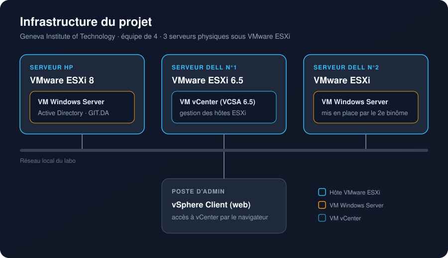

# Infrastructure VMware en équipe

Projet de groupe réalisé au **Geneva Institute of Technology** pendant ma première année de CFC d'informaticien.

On était 4. Avec mon binôme, on a fait la plus grosse partie : deux des trois serveurs et le vCenter. Les deux autres nous ont rejoints ensuite et ont monté le troisième serveur.

## Le matériel

On a travaillé sur 3 vrais serveurs, pas sur des machines virtuelles :

| Serveur | Hyperviseur | Ce qui tourne dessus |
|---|---|---|
| HP | VMware ESXi 8 | VM Windows Server avec l'Active Directory (domaine `GIT.DA`) |
| Dell n°1 | VMware ESXi 6.5 | vCenter Server Appliance (VCSA 6.5) |
| Dell n°2 | VMware ESXi | VM Windows Server (2e binôme) |

Le matériel était ancien et les modèles différents (2 Dell, 1 HP), et c'est ce qui nous a donné le plus de travail.

## Ce qu'on a fait

1. Installation de VMware ESXi sur les serveurs
2. Création d'une VM Windows Server sur le serveur HP
3. Mise en place d'Active Directory avec un domaine local `GIT.DA`
4. Tentative de déploiement de vCenter (VCSA) sur le HP : pas assez de stockage
5. Déploiement de vCenter sur le Dell n°1, qui avait assez d'espace disque
6. Gestion des hôtes depuis l'interface web de vCenter (vSphere Client)

## Les problèmes rencontrés

> **Pas assez de stockage sur le HP**
> Le déploiement de la VCSA demande beaucoup d'espace disque, le serveur HP ne suffisait pas.
> **Solution :** on a déplacé vCenter sur un des Dell, qui avait plus de stockage.

> **Compatibilité avec le vieux matériel**
> Les versions récentes d'ESXi et de vCenter ne passaient pas sur le Dell, trop ancien.
> **Solution :** on est redescendus en version 6.5 pour ESXi et pour la VCSA.

## Ce que j'en retiens

- Toujours vérifier la compatibilité matériel / version avant d'installer (la liste de compatibilité VMware sert à ça)
- Prévoir le stockage en fonction de ce qu'on va déployer, surtout pour vCenter
- Se répartir le travail clairement quand on est plusieurs sur la même infra

La documentation détaillée avec les captures d'écran est en cours de rédaction.
